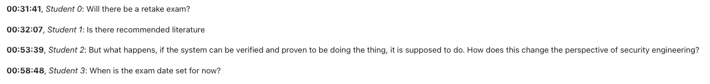

# Zoom Chat Anonymizer

This Python CLI tool anonymizes Zoom chat files so that one can store and provide them without privacy violations.
I wrote this script to anonymizes the Zoom chats of the lectures and tutorials of the course [Security Engineering](https://campus.tum.de/tumonline/WBMODHB.wbShowMHBReadOnly?pKnotenNr=460596) at the [Technical University of Munich (TUM)](https://www.tum.de/en/) in the years 2020-2022.
After the anonymization, I uploaded the chats to our [Moodle instance](https://www.moodle.tum.de/my/) so that the students watching the recording of the lecture can use the chats as an FAQ.



## Installation


```bash
pip install zoom-chat-anonymizer
```

## Usage

```bash
$ zoom-chat-anonymizer --help
Usage: zoom-chat-anonymizer [OPTIONS] COMMAND [ARGS]...

  Helpful script to process Zoom chats.

Options:
  --version  Version
  --help     Show this message and exit.

Commands:
  anonymize-zoom-chats       Anonymize Zoom chats.
  create-html-from-markdown  Create HTML files from the markdown files.
```

### Anonymize Zoom Chats

```bash
$ zoom-chat-anonymizer anonymize-zoom-chats --help
Usage: zoom-chat-anonymizer anonymize-zoom-chats [OPTIONS] [INPUT_FOLDER]

  Anonymize Zoom chats.

Arguments:
  [INPUT_FOLDER]  The folder with the chat files.  [default: .]

Options:
  -o, --output-folder DIRECTORY  The script will write the anonymized files in
                                 this folder.  [default: out]
  -t, --tutor TEXT               The tutors' names. The script will preserve
                                 these names in the chat protocol.
  -p, --pause-file FILE          A JSON file with the pauses made during the
                                 lecture/tutorial.
  -s, --starting-time TEXT       The starting time of the lecture/tutorial.
                                 [default: 14:15]
  --help                         Show this message and exit.
```

### Create HTML from Markdown

```bash
$ zoom-chat-anonymizer create-html-from-markdown --help
Usage: zoom-chat-anonymizer create-html-from-markdown [OPTIONS]

  Create HTML files from the markdown files.

Options:
  --bib_file FILE
  -i, --input_folder DIRECTORY
  --help                        Show this message and exit.
```

## Contact

If you have any question, just write [me](mailto:patrick.stoeckle@posteo.de?subject=Zoom-Chat-Anonymizer) an email.
